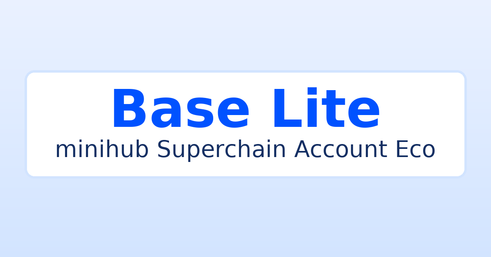

# Base Lite

> mini-hub for the **Superchain Eco** — education-first, Base-aligned guides, badge walkthroughs, and low-friction actions (daily check-in, onchain routines)

[](https://base-lite-pi.vercel.app/)
[](#license)

## What is it?

**Base Lite** is a tiny, fast web app that helps newcomers and builders:
- Understand the **Base** ecosystem with short, practical guides.
- Earn/track **badges** (with a clear “how/why/risks” section per badge).
- Keep a steady onchain cadence (planned: **Daily Check-in**).
- Nudge organic participation (governance, quests, social identity).
- (Planned) micro-rewards in **$wenaltszn** for streaks/ships.

It mirrors Celo Lite’s minimal UI/structure, adapted to **Base**:
- Transparent header, system **Light/Dark/Auto** theme.
- JS-only, no heavy CSS frameworks.
- Farcaster mini-app compatibility kept (meta + manifest).
- Clean separation for a future **Badges** section with per-badge guides.

## Live

- App: **https://base-lite-pi.vercel.app/**
- Repo: **https://github.com/wenalt/base-lite/**
- Farcaster: **https://farcaster.xyz/wenaltszn.eth**  
- Discord (Base): **https://discord.gg/buildonbase**  
- X (Base): **https://x.com/base**

## Screens



## Features

- ✅ Transparent header & Base-blue theme
- ✅ Reown AppKit integration
- ✅ Light/Dark/**Auto** theme toggle (remembered)
- ✅ Minimal wallet connect stub (AppKit slot ready)
- ✅ Footer shortcuts (Discord/X/Guild Base)
- ✅ **Daily Check-in** (one free, gas-sponsored action/day if possible)
- 🔜 **Badges** section with compact guides (Base-aligned copy)
- 🔜 **Creator/Builder Score** helper (Talent Protocol)
- 🔜 Optional rewards in **$wenaltszn** for streaks/ships

## Local dev

```bash
npm i
npm run dev
# open http://localhost:3000
